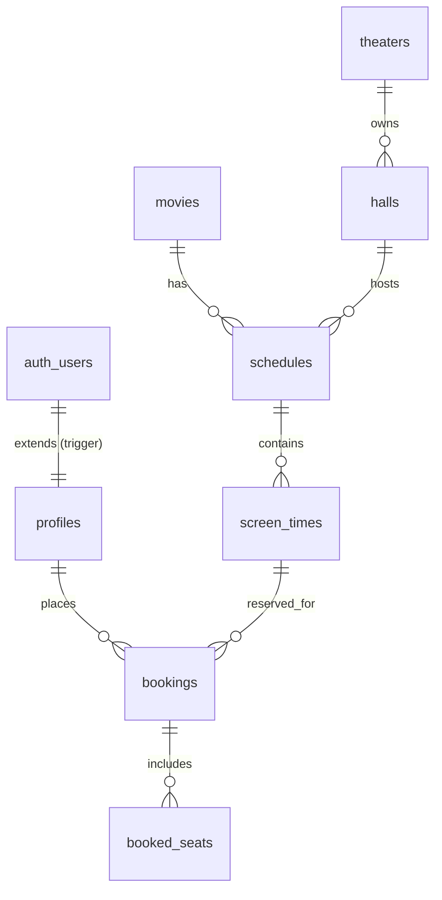

# CGV 모바일 영화 예매 서비스 Supabase 기반 백엔드 및 DB 구현 계획서

본 기획서는 현재 React/Next.js 기반으로 구축된 영화 예매 서비스의 데이터 구조와 비즈니스 로직을 분석하고, 이를 **Supabase(PostgreSQL 기반 BaaS)** 환경을 사용하여 구축하기 위한 데이터베이스 스키마 및 백엔드 아키텍처를 설계한 문서입니다.

---

## 1. Supabase 채택의 강점 및 아키텍처 개요

Supabase는 PostgreSQL 기반의 완전 관리형 백엔드 서비스(BaaS)로, 본 영화 예매 서비스에 다음과 같은 핵심 강점을 제공합니다.

1. **실시간 데이터 동기화 (Supabase Realtime)**: PostgreSQL 복제 기술을 활용하여, 다른 사용자가 좌석을 예약할 때 발생되는 `booked_seats` 테이블의 삽입/삭제 이벤트를 웹소켓 서버 구축 없이 클라이언트로 실시간 브로드캐스팅할 수 있습니다.
2. **행 레벨 보안 (Row Level Security - RLS)**: 사용자가 본인의 예매 내역(`bookings`)만 조회하고 타인의 예매 정보에 접근할 수 없도록 DB 레벨에서 강력한 접근 제어를 설정할 수 있습니다.
3. **Supabase Auth 연동**: 이메일 로그인, 소셜 로그인 및 비회원 임시 사용자 처리를 손쉽게 구현하며, 회원 테이블(`users`)과 자연스럽게 연계됩니다.
4. **Next.js와의 뛰어난 호환성**: `@supabase/ssr` 라이브러리를 통해 Next.js App Router의 Server Components, Route Handlers, Client Components에서 세션과 DB 연결을 매끄럽게 처리합니다.

---

## 2. Supabase (PostgreSQL) 데이터베이스 스키마 설계

Supabase 대시보드 또는 SQL Editor를 통해 생성할 스키마 스크립트입니다.



### 1) 프로필 테이블 (`profiles`)
Supabase 인증 시스템의 `auth.users` 테이블과 1:1 관계를 가지는 회원 확장 테이블입니다.
```sql
CREATE TABLE public.profiles (
    id UUID REFERENCES auth.users ON DELETE CASCADE PRIMARY KEY,
    name VARCHAR(100) NOT NULL,
    email VARCHAR(100) UNIQUE,
    created_at TIMESTAMP WITH TIME ZONE DEFAULT TIMEZONE('utc'::text, NOW()) NOT NULL
);

-- auth.users에 신규 유저 생성 시 profiles에 자동 insert하는 트리거 설정
CREATE OR REPLACE FUNCTION public.handle_new_user()
RETURNS TRIGGER AS $$
BEGIN
    INSERT INTO public.profiles (id, name, email)
    VALUES (NEW.id, COALESCE(NEW.raw_user_meta_data->>'name', '사용자'), NEW.email);
    RETURN NEW;
END;
$$ LANGUAGE plpgsql SECURITY DEFINER;

CREATE TRIGGER on_auth_user_created
    AFTER INSERT ON auth.users
    FOR EACH ROW EXECUTE FUNCTION public.handle_new_user();
```

### 2) 영화 테이블 (`movies`)
```sql
CREATE TABLE public.movies (
    id VARCHAR(50) PRIMARY KEY,
    title VARCHAR(255) NOT NULL,
    english_title VARCHAR(255),
    director VARCHAR(100),
    cast TEXT[],
    genre VARCHAR(50)[],
    runtime INT NOT NULL,
    release_date DATE NOT NULL,
    synopsis TEXT,
    poster_url VARCHAR(500),
    banner_url VARCHAR(500),
    status VARCHAR(20) CHECK (status IN ('now-showing', 'upcoming')),
    age_limit INT NOT NULL DEFAULT 0, -- 0(전체), 12, 15, 19
    rating NUMERIC(3, 2) DEFAULT 0.00
);
```

### 3) 극장 및 상영관 테이블 (`theaters`, `halls`)
```sql
CREATE TABLE public.theaters (
    id VARCHAR(50) PRIMARY KEY,
    name VARCHAR(100) NOT NULL,
    location VARCHAR(255) NOT NULL
);

CREATE TABLE public.halls (
    id SERIAL PRIMARY KEY,
    theater_id VARCHAR(50) REFERENCES public.theaters(id) ON DELETE CASCADE,
    name VARCHAR(50) NOT NULL,
    screen_type VARCHAR(20) NOT NULL CHECK (screen_type IN ('2D', 'IMAX', '4DX', 'SCREENX', 'DOLBY')),
    total_seats INT NOT NULL DEFAULT 183
);
```

### 4) 상영 스케줄 및 시간 테이블 (`schedules`, `screen_times`)
```sql
CREATE TABLE public.schedules (
    id SERIAL PRIMARY KEY,
    movie_id VARCHAR(50) REFERENCES public.movies(id) ON DELETE CASCADE,
    theater_id VARCHAR(50) REFERENCES public.theaters(id) ON DELETE CASCADE,
    hall_id INT REFERENCES public.halls(id) ON DELETE CASCADE,
    play_date DATE NOT NULL,
    UNIQUE (movie_id, theater_id, hall_id, play_date)
);

CREATE TABLE public.screen_times (
    id SERIAL PRIMARY KEY,
    schedule_id INT REFERENCES public.schedules(id) ON DELETE CASCADE,
    start_time TIME NOT NULL,
    end_time TIME NOT NULL,
    available_seats INT NOT NULL
);
```

### 5) 예매 내역 및 상세 예약 좌석 테이블 (`bookings`, `booked_seats`)
```sql
CREATE TABLE public.bookings (
    id VARCHAR(50) PRIMARY KEY, -- 예: 'BK-178400...'
    user_id UUID REFERENCES public.profiles(id) ON DELETE SET NULL,
    screen_time_id INT REFERENCES public.screen_times(id) ON DELETE RESTRICT,
    total_price INT NOT NULL,
    payment_method VARCHAR(50) NOT NULL,
    created_at TIMESTAMP WITH TIME ZONE DEFAULT TIMEZONE('utc'::text, NOW()) NOT NULL
);

CREATE TABLE public.booked_seats (
    id SERIAL PRIMARY KEY,
    booking_id VARCHAR(50) REFERENCES public.bookings(id) ON DELETE CASCADE,
    seat_id VARCHAR(10) NOT NULL,
    UNIQUE(booking_id, seat_id)
);
```

---

## 3. 행 레벨 보안 (RLS) 정책 설계

Supabase 테이블 보안 강화를 위해 권한별 RLS 정책(Row Level Security Policies)을 설정합니다.

### 1) 메타데이터 테이블 (영화, 극장, 상영시간표 등)
- 누구나 조회(`SELECT`)할 수 있으나, 생성/수정/삭제는 차단합니다.
```sql
ALTER TABLE public.movies ENABLE ROW LEVEL SECURITY;
CREATE POLICY "Allow public read access to movies" ON public.movies FOR SELECT USING (true);
```

### 2) 예매 정보 테이블 (`bookings`, `booked_seats`)
- 본인의 예매 내역만 조회(`SELECT`)하고 입력(`INSERT`)할 수 있으며, 수정 및 삭제는 불가능합니다.
```sql
ALTER TABLE public.bookings ENABLE ROW LEVEL SECURITY;

CREATE POLICY "Allow users to read their own bookings" 
    ON public.bookings FOR SELECT 
    USING (auth.uid() = user_id);

CREATE POLICY "Allow users to insert their own bookings" 
    ON public.bookings FOR INSERT 
    WITH CHECK (auth.uid() = user_id);
```

---

## 4. Supabase Realtime을 통한 실시간 좌석 현황 연동

가장 핵심적인 동시성 예매 시나리오인 **실시간 좌석 선택 상황 동기화**를 Supabase Realtime 기능으로 처리합니다.

### 1) Realtime 활성화 (PostgreSQL Publication)
`booked_seats` 테이블의 삽입/삭제 이벤트를 실시간 배포 목록에 등록합니다.
```sql
alter publication supabase_realtime add table public.booked_seats;
```

### 2) Next.js Client Component에서의 실시간 구독 (Subscription)
좌석 배치도 화면(`SeatMap.tsx`)에 진입 시, 해당 상영 시간 슬롯의 예매 좌석 데이터를 구독하고 상태를 실시간 변경합니다.
```typescript
import { useEffect, useState } from 'react';
import { createClient } from '@supabase/supabase-js';

const supabase = createClient(process.env.NEXT_PUBLIC_SUPABASE_URL!, process.env.NEXT_PUBLIC_SUPABASE_ANON_KEY!);

export function useRealtimeSeats(screenTimeId: number) {
  const [reservedSeats, setReservedSeats] = useState<string[]>([]);

  useEffect(() => {
    // 1. 초기 예약 완료 좌석 리스트 로드
    const fetchInitialSeats = async () => {
      const { data } = await supabase
        .from('booked_seats')
        .select('seat_id, bookings!inner(screen_time_id)')
        .eq('bookings.screen_time_id', screenTimeId);
      
      if (data) {
        setReservedSeats(data.map((item: any) => item.seat_id));
      }
    };
    
    fetchInitialSeats();

    // 2. 실시간 예약 상태 구독 설정
    const channel = supabase
      .channel(`realtime-seats-${screenTimeId}`)
      .on(
        'postgres_changes',
        { event: '*', schema: 'public', table: 'booked_seats' },
        (payload) => {
          if (payload.eventType === 'INSERT') {
            setReservedSeats((prev) => [...prev, payload.new.seat_id]);
          } else if (payload.eventType === 'DELETE') {
            setReservedSeats((prev) => prev.filter(s => s !== payload.old.seat_id));
          }
        }
      )
      .subscribe();

    return () => {
      supabase.removeChannel(channel);
    };
  }, [screenTimeId]);

  return reservedSeats;
}
```

---

## 5. 결제 및 좌석 충돌 최종 보장 (Database RPC Transaction)

중복 예약을 안전하게 예방하기 위해, 결제 완료 후 여러 좌석 데이터를 단일 트랜잭션으로 입력하는 PostgreSQL 함수(RPC)를 Supabase에 배포하여 실행합니다.

```sql
CREATE OR REPLACE FUNCTION public.create_booking_transaction(
    p_booking_id VARCHAR(50),
    p_user_id UUID,
    p_screen_time_id INT,
    p_total_price INT,
    p_payment_method VARCHAR(50),
    p_seats VARCHAR(10)[]
) RETURNS VOID AS $$
DECLARE
    v_seat VARCHAR(10);
    v_already_exists INT;
BEGIN
    -- 1. 중복 예약 여부를 비관적 락으로 최종 확인
    FOREACH v_seat IN ARRAY p_seats LOOP
        SELECT COUNT(*) INTO v_already_exists
        FROM public.booked_seats bs
        JOIN public.bookings b ON bs.booking_id = b.id
        WHERE b.screen_time_id = p_screen_time_id AND bs.seat_id = v_seat;

        IF v_already_exists > 0 THEN
            RAISE EXCEPTION 'Seat % is already booked.', v_seat;
        END IF;
    END LOOP;

    -- 2. 예매 내역 추가
    INSERT INTO public.bookings (id, user_id, screen_time_id, total_price, payment_method)
    VALUES (p_booking_id, p_user_id, p_screen_time_id, p_total_price, p_payment_method);

    -- 3. 좌석 리스트 추가
    FOREACH v_seat IN ARRAY p_seats LOOP
        INSERT INTO public.booked_seats (booking_id, seat_id)
        VALUES (p_booking_id, v_seat);
    END LOOP;
END;
$$ LANGUAGE plpgsql;
```
