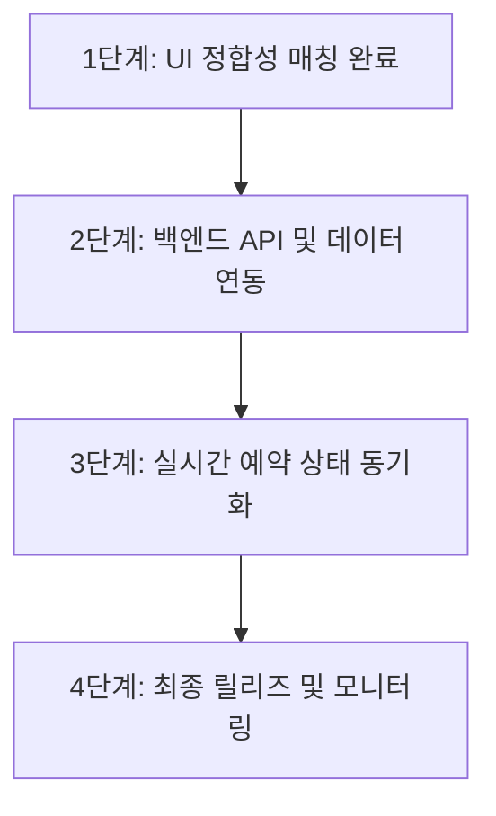

# CGV 모바일 영화 예매 서비스 정합성 개선 계획 및 완료 보고서

본 계획서는 CGV 영화 예매 서비스의 레이아웃, 디자인, 인터랙션 디테일을 레퍼런스 모바일 캡처 이미지와 100% 일치하도록 보정하고, 기능 및 사용 편의성을 극대화하기 위해 작성된 명세 및 완료 보고서입니다.

---

## 1. 정합성 매칭 개선 완료 계획 및 결과

### 1) 홈 화면 및 상세보기 연동
- **개선 내용**: 
  - 상영 예정작(예: *스파이더맨-브랜드 뉴 데이*)의 카드 중앙 버튼을 기존 단순 텍스트(`상영예정`)에서 상세 페이지로 이동할 수 있는 `상세보기` 버튼으로 개편하였습니다 (`홈2.jpg` 적용).
- **효과**: 사용자가 예매 가능한 영화와 개봉 예정작을 명확히 구분하고 상세 정보를 즉각 파악할 수 있는 흐름을 제공합니다.

### 2) 영화 상세 페이지 개봉 예정작 뷰 개편
- **개선 내용**:
  - 개봉 예정작 상세 페이지 접속 시, 하단 sticky 영역의 예매 버튼을 숨기고 본문 하단에 `프롤로그` 섹션을 신설하였습니다.
  - 확성기 아이콘(`📢`)과 함께 `차주 예매 오픈 예정`이라는 회색 공지 배너를 노출시켜 `영화 상세페이지2.jpg`와 정합시켰습니다.

### 3) 예매 시간표 카드 디테일 보정
- **개선 내용**:
  - 시간표 카드의 디자인을 `예매창 아래쪽 시간표.jpg`에 맞게 정밀 튜닝하였습니다.
  - 시작 시간과 종료 시간을 한 줄에 묶어 가독성을 높였습니다 (`10:30-13:16`).
  - 12시 이전 오전 타임 일정에는 잔여 좌석 옆에 해 아이콘(`☀️`)을 동적으로 노출합니다.
  - 카드의 가장 하단에 상영관 이름(예: `5관`, `2관`)을 단독 노출하여 깔끔함을 더했습니다.

### 4) 인원 선택 및 좌석 상태 드로어 최적화
- **개선 내용**:
  - 인원 선택 화면 하단의 좌석 상태 표시 뷰를 `인원선택창 아래쪽.jpg` 및 `인원선택창 아래쪽(좌석선택후).jpg`와 완전히 똑같게 구현했습니다.
  - 선택한 인원수를 직관적으로 알려주는 흰색 알약 배지(`일반 {인원수}`)를 배치했습니다.
  - 좌석이 아직 선택되지 않은 경우 `좌석을 선택해 주세요` 문구와 함께 빨간색 `선택` 버튼을 노출합니다.
  - 좌석이 선택되면 빨간색 원형의 좌석번호 배지(예: `L6`, `L7`)들과 흰색 `변경` 버튼이 활성화됩니다.
  - 스크린 곡선 가이드 라인, 미니 좌석 배치도 및 스마트 시트 운영 주의사항 배너가 언제나 렌더링되도록 처리했습니다.

### 5) 어두운 테마 기반 자리 선택 화면 (`SeatMap.tsx`)
- **개선 내용**:
  - `자리선택창.jpg`를 모사하여 시트 선택 구역의 배경을 깊은 어두운 톤(`#1A1D24`)으로 개편하여 실제 영화관 스크린 집중 환경을 구현했습니다.
  - 상단에 현재 선택된 극장과 관 이름(`📍 건대입구 5관`)을 흰색 헤더 바에 닫기 버튼(`✕`)과 함께 배치했습니다.
  - 개별 시트 버튼 안에는 열과 번호가 포함된 시트 코드(예: `B1`, `B2`)를 직접 작게 출력하였고, `A7`, `A8` 휠체어석은 연청색 배경으로 고유하게 연출했습니다.

### 6) 결제 화면 1/2/3단계 시뮬레이션 완벽 이식
- **개선 내용**:
  - `결제창1/2/3.jpg` 레퍼런스 이미지의 UI 흐름을 결제 시뮬레이션에 그대로 투영했습니다.
  - 상단 흰색 헤더 영역에 뒤로가기 버튼(`‹`)과 현재 예약 지점(`📍 건대입구`)을 배치했습니다.
  - 앱카드 등 결제 수단 선택 시 `BC카드` 및 `페이북/ISP` 드롭다운과 ISP 결제 주의사항 안내문 상자를 출력합니다.
  - CJ ONE 포인트 부족 안내 배너와 기프트 카드 조회 링크를 연동하고 최종 약관 동의 체크박스 상태에 따라 결제가 실행되도록 매칭했습니다.

### 7) 시네톡 및 매점(패스트오더) 서비스 연동
- **개선 내용**:
  - 푸터 네비게이션을 통해 사용 가능한 실시간 토크 피드인 `시네톡` 페이지와 팝콘/음료 가상 카트 및 대기 번호를 발급해주는 `매점` 페이지의 흐름을 보완하고 연결을 완결지었습니다.

---

## 2. 향후 유지보수 및 고도화 계획 (Roadmap)

### [1단계] 백엔드 및 실시간 데이터베이스 연동
- **계획**: 현재 하드코딩된 mock 스케줄 및 가상 계정 데이터를 실제 관계형 데이터베이스(RDB) 및 REST API 백엔드 환경과 연결하여 사용자별 예약 내역이 안전하게 서버로 영속화되도록 합니다.

### [2단계] 소켓 통신을 활용한 실시간 좌석 예약 동기화
- **계획**: 다중 사용자가 동시에 동일한 좌석을 예약할 때 발생할 수 있는 충돌을 방지하기 위해 WebSockets 또는 Server-Sent Events(SSE)를 활용하여 실시간으로 예약된 좌석 현황이 좌석 배치도 화면에 즉시 동기화되도록 고도화합니다.

### [3단계] 실결제 모듈 (토스페이먼츠, 아임포트 등) 연동
- **계획**: PG사 모듈을 추가하여 가상 결제 시뮬레이션에서 벗어나, 소액 결제나 실제 테스트용 포인트 카드 연계 결제가 가능하도록 확장할 예정입니다.
